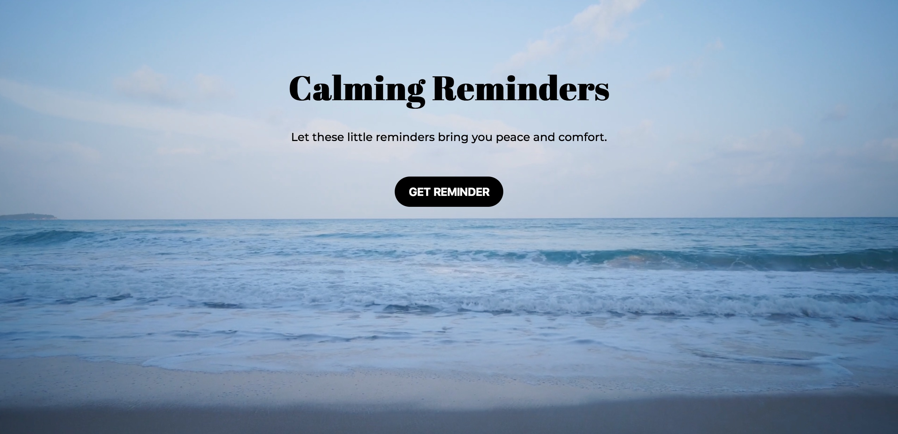

# Calming Reminders
Calming reminders to help you relax 🌊

### Screenshot

### Links

- Live Site URL: [Add live site URL here](https://live-site-url.com)

### Built with

- Semantic HTML5 markup
- CSS 
- SASS
- Flexbox
- JavaScript
- Mobile-first workflow

### What I learned
I loved playing around with styling and SASS on this project. I learned more about creating hero videos for desktop and hero images for mobile and tablet. I also got to practice a bit of JavaScript and created a function that toggles between showing/hiding an element and generating a random item from an array.

### Continued development

### Useful resources

## Author

- GitHub - [malin-nilsson](https://github.com/malin-nilsson)

## Acknowledgments
Photo by Nathan Dumlao on Unsplash 
https://unsplash.com/photos/0tykfPL2U7w

Video by Alexandr Podvalny on Pexels
https://www.pexels.com/sv-se/video/1893746/

Quotes from:
https://www.thegoodtrade.com/features/positive-affirmations-morning-routine
